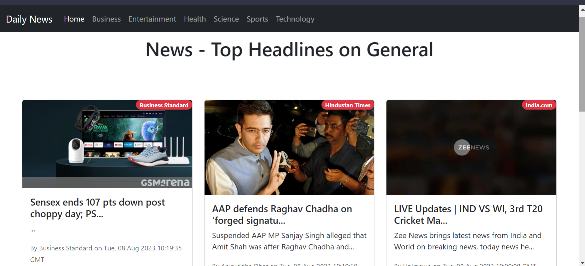
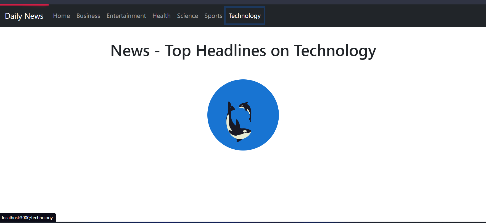
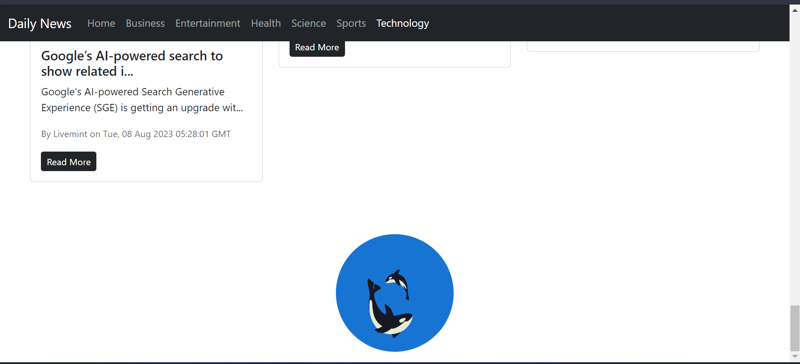
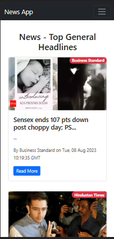
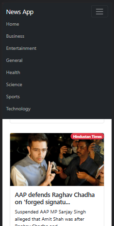

# Daily News React Web App

The Daily News React Web App is a dynamic and user-friendly web application that provides users with easy access to a wide range of news articles from various categories including Entertainment, Business, General, Health, Sports, Science, and Technology. Stay informed about the latest happenings around the world with just a few clicks.
 # Desktop View

# Loading interface 


# Mobile View




## Features

- **Category Selection**: Choose from a diverse range of news categories to explore articles that interest you the most.

- **Latest News**: Access up-to-date news articles, ensuring you are always in the loop with current events.

- **User-Friendly Interface**: The app offers an intuitive and easy-to-navigate interface, making your news reading experience smooth and enjoyable.

- **Responsive Design**: Whether you're using a desktop, tablet, or smartphone, the app is designed to adapt to various screen sizes for a consistent experience.

- **Save Favorites**: Mark articles as favorites to quickly access them later, even across different devices.

## How to Use

1. **Homepage**: Upon launching the web app, you'll land on the homepage where you can see a curated selection of top news articles from different categories.

2. **Category Selection**: Use the navigation menu or the category tabs to explore news articles from specific categories.

3. **Article View**: Click on an article's title or image to read the full story. Navigate back to the list by using the provided navigation options.

4. **Search**: If you're looking for something particular, enter keywords into the search bar at the top. The app will display relevant articles based on your search.

5. **Favorites**: To save an article as a favorite, click the heart icon associated with the article. You can access your favorites from the user profile or menu.

6. **Responsive Design**: Whether you're using a desktop computer, tablet, or smartphone, the app will adjust to provide the best viewing experience for your device.

## Installation

1. Clone this repository to your local machine using:
   ```
   git clone https://github.com/yourusername/daily-news-react-app.git
   ```

2. Navigate to the project directory:
   ```
   cd daily-news-react-app
   ```

3. Install the required dependencies using a package manager like npm or yarn:
   ```
   npm install
   ```

4. Start the development server:
   ```
   npm start
   ```

5. Open your web browser and go to `http://localhost:3000` to use the app.

## Usage

1. On the homepage, you'll see a list of top news articles from various sources.
2. Use the navigation bar to select different categories (e.g., Business, Entertainment, Health, etc.).
3. Click on a news article to view its detailed information.
4. Navigate back to the homepage or switch to a different category using the navigation bar.


## Technologies Used

- React: JavaScript library for building user interfaces.
- Bootstrap: Front-end framework for responsive and mobile-first design.
- React Router: Library for handling navigation within a React application.
- News API: External API used to fetch news articles from various sources.

Stay informed and engaged with the world's latest news through the Daily News React Web App. Explore articles, save your favorites, and enjoy a seamless news browsing experience.
